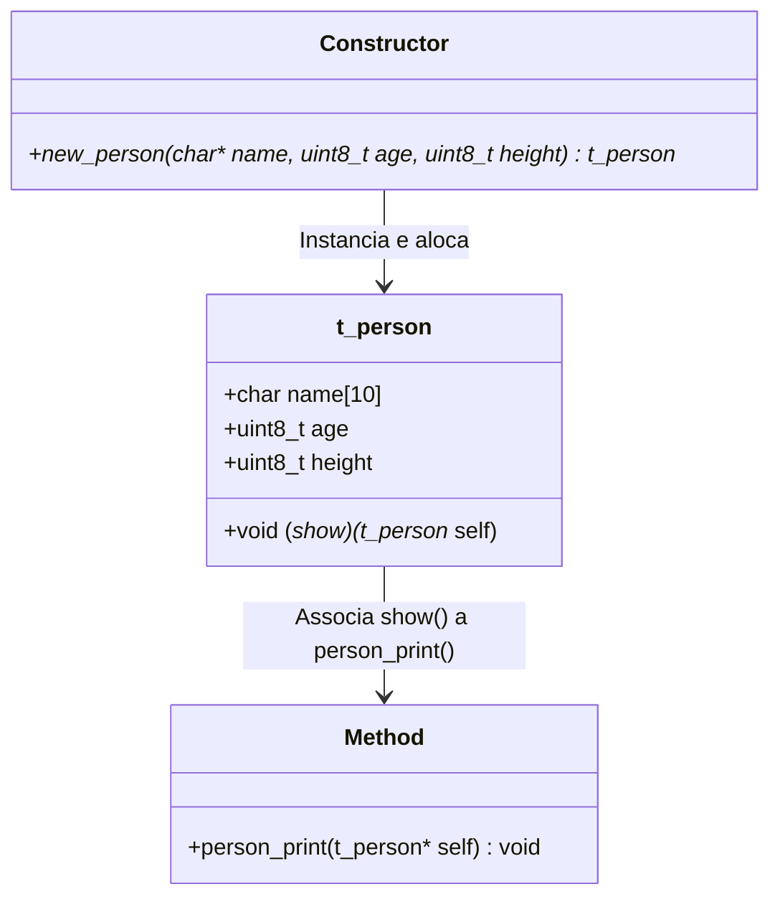

# Pseudo-Object Orientation in C

[](https://en.cppreference.com/w/c)
[](LICENSE)

Este repositório apresenta uma demonstração prática de como simular conceitos de **Orientação a Objetos (OO)** na linguagem **C**. Utilizando estruturas (`struct`) e ponteiros de função, simulamos encapsulamento de dados e associação de métodos.

---

## 💡 O Conceito de Pseudo-OO em C

A linguagem C não possui suporte nativo à Orientação a Objetos. No entanto, podemos alcançar comportamentos semelhantes através de:

1. **Encapsulamento**: Agrupando variáveis (atributos) dentro de uma estrutura (`struct`).
2. **Métodos**: Associando ponteiros de função a essa estrutura, permitindo invocar funções no contexto de um "objeto".
3. **Construtores**: Funções que alocam memória dinâmica para a estrutura, inicializam seus membros e ligam as funções correspondentes.
4. **Ponteiro `self`**: Passando a própria instância como primeiro parâmetro do método para acessar os atributos da instância (semelhante ao `this` em C++ ou `self` em Python).

---

## 📊 Diagrama de Estrutura (Simulação de Classe)

O diagrama abaixo ilustra como a estrutura `t_person` atua como uma classe que armazena dados e aponta para seu método de exibição:



---

## 📁 Estrutura dos Arquivos

| Arquivo | Descrição |
| :--- | :--- |
| [pseudo_object.h](file:///spot/NdDaniel/Code/42/Pseudo-Object-Orientation-in-C/pseudo_object.h) | Cabeçalho com a definição de `t_person` e inclusão das dependências padrão. |
| [pseudo_object.c](file:///spot/NdDaniel/Code/42/Pseudo-Object-Orientation-in-C/pseudo_object.c) | Implementação do construtor, do método de impressão e da função `main` para execução. |

---

## 🛠️ Detalhes de Implementação

### A Estrutura `t_person`
Definida em [pseudo_object.h](file:///spot/NdDaniel/Code/42/Pseudo-Object-Orientation-in-C/pseudo_object.h):
```c
typedef struct s_person
{
	char	name[10];
	uint8_t	age;
	uint8_t	height;
	void	(*show)(struct s_person *);
}			t_person;
```

### O Construtor `new_person`
Aloca dinamicamente o espaço da struct, define os atributos iniciais e faz o "binding" da função `person_print` ao ponteiro de método `show`:
```c
t_person	*new_person(char *name, uint8_t age, uint8_t height)
{
	t_person	*self;

	self = malloc(sizeof(t_person));
	if (self == NULL)
		return (NULL);
	strcpy(self->name, name);
	self->age = age;
	self->height = height;
	self->show = &person_print;
	return (self);
}
```

---

## 🚀 Como Compilar e Executar

Certifique-se de ter um compilador C (como o `gcc` ou `clang`) instalado em sua máquina.

### 1. Compilação
No terminal, execute o seguinte comando:
```bash
gcc -Wall -Wextra -Werror pseudo_object.c -o pseudo_object
```

### 2. Execução
Execute o binário gerado:
```bash
./pseudo_object
```

### Saída Esperada
```text
Name: Fabio Age: 43 Height: 173
```

---

## ⚠️ Boas Práticas e Limitações

> [!IMPORTANT]
> **Gerenciamento de Memória**: Por estarmos alocando memória dinamicamente no construtor `new_person` usando `malloc()`, é fundamental liberar essa memória ao final da utilização usando a função padrão `free()`. O código principal (`main`) já faz essa liberação de forma segura.

> [!WARNING]
> **Segurança de Buffer**: O campo `name` possui tamanho estático limite de 10 caracteres (`char name[10]`). Copiar nomes maiores sem validação prévia com `strcpy` pode causar estouro de buffer (*buffer overflow*). Em projetos de produção, recomenda-se o uso de `strncpy` ou validação do tamanho do nome antes de copiá-lo.
